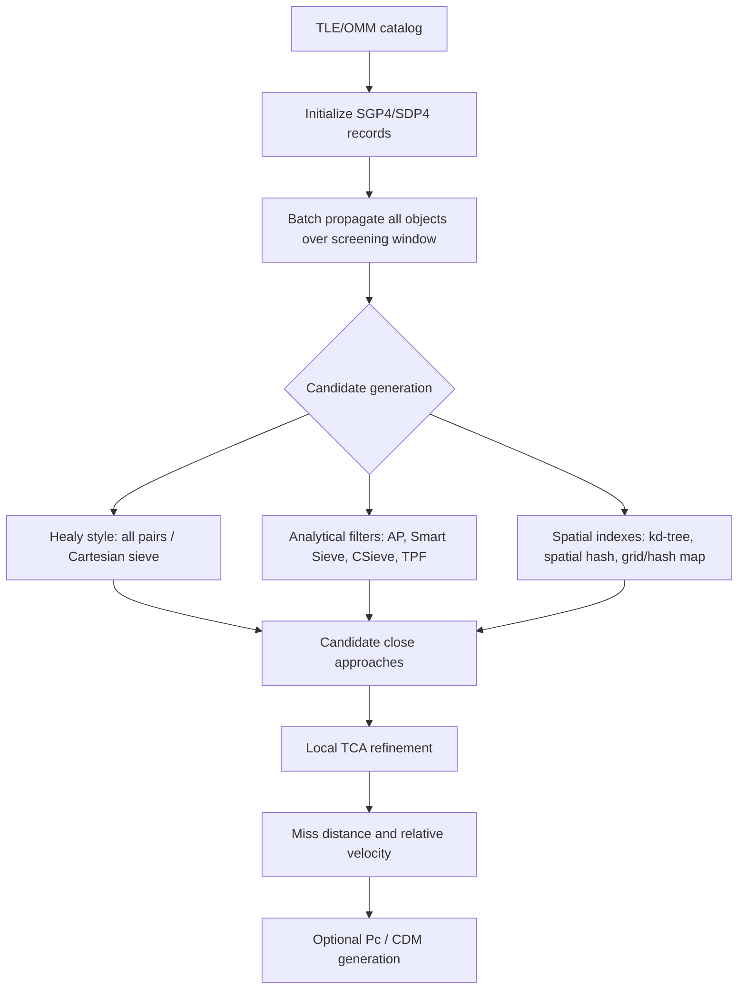

# Efficient all-catalog satellite conjunction screening with SGP4: literature report

## Executive summary

The Healy paper you were thinking of is **Liam M. Healy, "Close conjunction detection on parallel computer," Journal of Guidance, Control, and Dynamics, 18(4), 824-829, 1995**.[^healy-doi] It describes **CM-COMBO**, a Connection Machine implementation for finding close conjunctions for "one, a few, or all satellites" against a catalog, using an **arbitrary propagator** and **no orbit prefiltering**.[^healy-abstract] That makes it directly relevant to your intended SGP4 approach: SGP4 can be the propagator, while the screening algorithm operates on Cartesian position samples.

For thousands of objects, Healy is the right conceptual anchor but not the best final architecture by itself. Its core idea is effectively "propagate everyone, then compare all pairs in parallel"; that is simple and complete at sampled times, but it remains quadratic in object count.[^healy-abstract] Modern papers improve on it using GPU/OpenMP parallelism, analytical prefilters, and spatial indexes such as kd-trees, spatial hashes, grids, and atomic hash maps.[^budianto][^hellwig][^lin][^saingyen-2023] The most relevant modern direction for an SGP4 implementation is: **batch SGP4 propagation -> spatial or analytical candidate generation -> local TCA refinement -> probability/risk assessment only for survivors**.

## Query classification and assumptions

This is a **technical literature deep-dive**. I assumed "all conjunctions for thousands of objects at once" means catalog-scale **all-vs-all or fleet-vs-catalog close-approach screening**, not final collision probability computation for every pair. I also assumed you want an implementation-compatible reading list for a TLE/SGP4 pipeline, so the report emphasizes candidate-generation algorithms and their scaling behavior.

## The Healy paper

| Field | Detail |
|---|---|
| Paper | **"Close conjunction detection on parallel computer"** |
| Author | **Liam M. Healy**, Naval Research Laboratory |
| Venue | *Journal of Guidance, Control, and Dynamics*, Vol. 18, No. 4 |
| Pages/year | 824-829, July 1995 |
| DOI | `10.2514/3.21465` |
| Open copy | DRUM/University of Maryland provides a scanned PDF and metadata record |

The DRUM metadata gives the key abstract text: the program is implemented on the Connection Machine as **CM-COMBO**; it finds conjunctions over a time range for "one, a few, or all satellites against the original or another catalog"; it works with an "arbitrary propagator"; and it "does not prefilter any orbits" or assume a particular orbit type.[^healy-abstract] That is why this is almost certainly the paper you had in mind.

The most useful recovered algorithm hint is a DRUM curatorial note saying the paper's algorithm, as applied to a single Cartesian coordinate, is then applied successively to the other coordinates to select satellites within a specified distance.[^healy-abstract] In practical terms, that is a coordinate-wise Cartesian sieve:

1. Propagate all objects to a time sample.
2. Test pair coordinate separations, e.g. `|dx| <= threshold`, then `|dy| <= threshold`, then `|dz| <= threshold`.
3. Compute full Euclidean distance only for pairs passing the cheap coordinate tests.
4. Repeat over the time grid and refine candidate events.

Healy's important design choice is **not** that prefilters are bad; it is that massive parallel hardware made a no-prefilter all-pairs pass feasible for the 1990s catalog.[^healy-abstract] The benefit is conceptual simplicity and no geometry-filter false negatives within sampled times. The cost is quadratic work and a separate need to choose a time step fine enough not to skip fast LEO crossings.

## How this maps to SGP4 today

Healy's method is propagator-agnostic, so an SGP4/TLE implementation can use the same abstraction: generate Cartesian states for all objects over a time grid, then screen those states for close approaches.[^healy-abstract] Modern SGP4-oriented papers and systems mostly differ in how they reduce or parallelize the pair search.

For "thousands" of objects, pure all-pairs can be acceptable if heavily parallelized, but the literature strongly points toward adding a candidate-generation layer. The most implementation-relevant options are:

| Approach | Best papers | Why it matters |
|---|---|---|
| Pure parallel all-pairs / Cartesian sieve | Healy 1995 | Clean baseline; no orbital prefilter assumptions; maps directly to batch SGP4 states.[^healy-abstract] |
| Classical orbital filters | Hoots et al. 1984; Woodburn 2009; Alfano & Finkleman 2014 | Cheaply reject most impossible pairs before detailed propagation/refinement.[^hoots][^woodburn][^alfano-finkleman] |
| Smart Sieve / CSieve / CAOS-D | Alarcon Rodriguez et al. 2002; Saingyen et al. 2023 | Operational-style filter cascades; benchmarked in one-vs-all and all-vs-all CUDA settings.[^smart-sieve][^saingyen-2023] |
| GPU/OpenMP SGP4 screening | Kim et al. 2012; Lin et al. 2017; Saingyen et al. 2021/2023 | Keeps all-pairs or filter cascades but maps them to commodity parallel hardware.[^kim][^lin][^saingyen-2021][^saingyen-2023] |
| Spatial ephemeris indexing | Budianto-Ho et al. 2014; Hellwig et al. 2023 | Best asymptotic direction: index propagated positions instead of comparing every pair.[^budianto][^hellwig] |
| ML prefilters | Stevenson et al. 2023 | Useful benchmark for future mega-catalogs; less attractive as a first implementation because interpretability and false-negative control matter.[^stevenson] |

## Key papers and what to read them for

### 1. Healy 1995 — the paper you likely want

Read this for the original **parallel all-catalog conjunction screening** formulation. It is especially useful because it separates propagation from screening: the abstract explicitly says the program works with an arbitrary propagator.[^healy-abstract] For your use case, that arbitrary propagator can be SGP4.

Main takeaways:

- It supports one-vs-catalog, few-vs-catalog, and all-vs-all catalog screening.[^healy-abstract]
- It deliberately avoids orbit prefilters and orbit-type assumptions.[^healy-abstract]
- Its accessible metadata implies a Cartesian coordinate sieve rather than a purely orbital-element filter.[^healy-abstract]
- It is best treated as the **baseline** or correctness model, not the final scaling answer.

### 2. Hoots, Crawford & Roehrich 1984 — analytical close-approach foundation

Hoots et al. is the classic NORAD-era analytical method for future close approaches.[^hoots] It introduced the core idea of cascading cheap filters before expensive close-approach calculations: apogee/perigee radial-band filtering, orbit-path filtering, and time filtering.[^filters] If you are using SGP4, these filters are still relevant, but margins must account for TLE/SGP4 errors and secular/periodic perturbations.[^alfano-finkleman]

Use this paper to understand why most operational systems do not do a naive all-pairs propagation/refinement for every pair.

### 3. Woodburn 2009 — practical filter taxonomy

Woodburn's **"A Description of Filters for Minimizing the Time Required for Orbital Conjunction Computations"** is the practical filter catalogue: apogee/perigee, radial filters, RIC box filters, and final 3D distance checks.[^woodburn] The original AGI download link appears to be dead, but the paper is widely cited and summarized by later work.[^filters]

Use this for filter ordering and implementation design.

### 4. Alfano & Finkleman 2014 — choosing filter thresholds safely

The key issue with any prefilter is avoiding false negatives. Alfano & Finkleman apply ROC/signal-detection analysis to filter threshold selection.[^alfano-finkleman] For TLE/SGP4, a filter threshold should generally be larger than the physical collision or alerting distance because catalog error can be much larger than the hard-body or miss-distance threshold.[^filters]

Use this paper to decide how much padding to put on filters.

### 5. Smart Sieve and CAOS-D lineage

Alarcon Rodriguez, Martinez Fadrique, and Klinkrad introduced the ESA **Smart Sieve** method for collision-risk assessment.[^smart-sieve] Later GPU/CUDA work benchmarks Smart Sieve, CSieve, and CAOS-D in both one-vs-all and all-vs-all settings.[^saingyen-2023]

Use this lineage if you want an operational-style analytical filter cascade before SGP4-intensive work.

### 6. Kim et al. 2012 — GPU plus apogee/perigee filter

Kim, Kim, and Seong studied computational-efficiency improvements using GPU acceleration, an apogee/perigee filter, and the combination of both.[^kim] The reported speedups were about **34x for GPU only**, **3x for apogee/perigee filtering only**, and **163x for the combination**.[^spatial-report] This is a good empirical reminder that hardware parallelism and filtering multiply each other.

### 7. Lin, Xu & Fu 2017 — GPU SGP4/SDP4 initial screening

Lin et al. is directly relevant because its title explicitly combines **SGP4/SDP4 models** and **GPU acceleration** for initial space-debris collision screening.[^lin] It is the closest modern analogue to Healy if your question is "how do I redo CM-COMBO on modern hardware with SGP4?"

### 8. Saingyen et al. 2021 and 2023 — OpenMP/CUDA filter implementations

The 2021 iEECON paper combines analytical screening with OpenMP and reports a 20,000-object, 7-day screening case reduced from more than 10 hours to about 1.3 hours.[^saingyen-2021] The 2023 *Aerospace* paper is open access and compares Smart Sieve, CSieve, and CAOS-D filters under CUDA for both single-satellite-vs-all and all-vs-all cases.[^saingyen-2023]

Use these if you want an implementable CPU/GPU pattern rather than a historical Connection Machine architecture.

### 9. Budianto-Ho et al. 2014 — spatiotemporally indexed ephemeris

Budianto-Ho et al. is one of the most directly relevant papers for improving on Healy. It describes **spatiotemporally indexed ephemeris data** using a **kd-tree** and **spatial hashing**, replacing quadratic pair enumeration with spatial range queries over propagated ephemeris samples.[^budianto] The reported scale in the abstract is a 100,000-object catalog over one day on a 64-core, 1 TB shared-memory system.[^budianto]

Use this if you want sub-quadratic candidate generation after SGP4 propagation.

### 10. Hellwig et al. 2023 — modern spatial data structures

Hellwig et al. propose a grid-based method using **non-blocking atomic hash maps** plus a hybrid method combining grid indexing with traditional filter chains.[^hellwig] The abstract states that the methods target populations with **millions of satellites**, with the grid variant using less memory and the hybrid variant being faster when enough memory is available.[^hellwig]

Use this as the most modern high-performance-computing paper on spatial data structures for conjunction detection.

### 11. Stevenson et al. 2023 — all-vs-all ML benchmark

Stevenson et al. benchmark deep-learning approaches for all-vs-all conjunction screening using a dataset of about **170 million object pairs** over a 7-day screening period, generated with CNES BAS3E.[^stevenson] This is less likely to be the first thing to implement, but it is useful for benchmarking and for understanding how the field is thinking about future mega-catalogs.

### 12. Rivero, Bombardelli & Vazquez 2025 — recent analytical prefilter

The recent **short-term space occupancy** paper proposes a more modern analytical prefilter that bounds the altitude range an object can occupy over a screening horizon under a zonal gravity model.[^rivero] It generalizes the classical apogee/perigee idea and is relevant if you want a conservative first-stage filter before SGP4 propagation.

## Recommended implementation strategy for thousands of objects with SGP4

For a first serious implementation, I would not implement Healy as a literal N-squared loop over every pair at every time sample unless the target catalog is small or the goal is a correctness baseline. A stronger architecture is:

1. **Batch-propagate all TLEs with SGP4** over a fixed screening window.
2. **Use a conservative first-stage prefilter**, such as apogee/perigee with padding, Smart Sieve/CSieve, or a recent space-occupancy bound.
3. **Use spatial indexing on propagated states** at each time sample: kd-tree, spatial hash, or grid/hash-map range query.
4. **Record unique candidate pairs** and refine TCA locally around the closest sampled time.
5. **Compute Pc only for candidates**, not for all pairs.

This keeps Healy's main advantage--a propagator-agnostic Cartesian state pipeline--but borrows the scaling improvements from later work.[^healy-abstract][^budianto][^hellwig]

## Reading order

| Priority | Paper | Why |
|---|---|---|
| 1 | **Healy 1995** | The paper you identified; defines CM-COMBO and the all-catalog no-prefilter parallel baseline.[^healy-abstract] |
| 2 | **Hoots et al. 1984** | Foundational close-approach/filter method.[^hoots] |
| 3 | **Woodburn 2009** | Practical filter taxonomy.[^woodburn] |
| 4 | **Alfano & Finkleman 2014** | How to choose filter parameters without missing events.[^alfano-finkleman] |
| 5 | **Budianto-Ho et al. 2014** | kd-tree/spatial-hash ephemeris indexing; directly addresses the all-pairs scaling problem.[^budianto] |
| 6 | **Lin et al. 2017** | GPU SGP4/SDP4 screening.[^lin] |
| 7 | **Saingyen et al. 2023** | Open CUDA benchmark of Smart Sieve/CSieve/CAOS-D.[^saingyen-2023] |
| 8 | **Hellwig et al. 2023** | Most modern spatial-data-structure/HPC treatment.[^hellwig] |
| 9 | **Stevenson et al. 2023** | ML benchmark and 170M-pair dataset context.[^stevenson] |

## Confidence assessment

**High confidence:** Healy 1995 is the intended paper; its title, author, venue, pages, DOI, DRUM metadata, and abstract phrases were independently recovered.[^healy-doi][^healy-abstract] It is also high confidence that Healy's method is compatible with SGP4 because the abstract explicitly says "arbitrary propagator."[^healy-abstract]

**Medium confidence:** The exact internal details of CM-COMBO beyond the abstract and DRUM metadata are less certain because the accessible PDF is a scanned image and the AIAA publisher copy is paywalled. The Cartesian-coordinate sieve is supported by DRUM metadata, but full equations, exact time steps, and benchmark timings would require reading/OCRing the full scan.[^healy-abstract]

**High confidence:** The modern recommendation--SGP4 batch propagation plus conservative filters and/or spatial indexing--is strongly supported by multiple later papers: Budianto-Ho et al. for kd-tree/spatial hashing, Hellwig et al. for grid/hash maps, and Saingyen et al. for CUDA filter benchmarking.[^budianto][^hellwig][^saingyen-2023]

**Important caveat:** Prefilters trade speed for calibration risk. With TLE/SGP4, filter margins must be conservative enough to avoid false negatives; Alfano & Finkleman is the key paper for that threshold-selection problem.[^alfano-finkleman]

## Footnotes

[^healy-doi]: L. M. Healy, "Close conjunction detection on parallel computer," *Journal of Guidance, Control, and Dynamics*, 18(4), 824-829, 1995, DOI [`10.2514/3.21465`](https://doi.org/10.2514/3.21465).

[^healy-abstract]: DRUM/University of Maryland metadata and scanned PDF for Healy 1995: item [`1937d7ee-54fc-44ef-b0eb-c8f7feb9d832`](https://drum.lib.umd.edu/items/1937d7ee-54fc-44ef-b0eb-c8f7feb9d832), handle [`1903/2287`](http://hdl.handle.net/1903/2287), direct bitstream URL `https://api.drum.lib.umd.edu/server/api/core/bitstreams/d851f54e-6f5e-4de2-9adf-63c13009afcf/content`. Subagent recovered the abstract text and DRUM curatorial note from the DSpace API record.

[^hoots]: F. R. Hoots, L. L. Crawford, and R. L. Roehrich, "An analytic method to determine future close approaches between satellites," *Celestial Mechanics*, 33(2), 143-158, 1984, DOI [`10.1007/BF01234152`](https://doi.org/10.1007/BF01234152).

[^filters]: Research subagent synthesis of classical filter papers: Hoots et al. 1984; Alfano & Negron 1992/1993; Alfano 1994; Healy 1995; Woodburn 2009; Alfano 2012; Alfano & Finkleman 2014. Key extracted filter types: apogee/perigee, orbit path, time filter, toroidal path, RIC box, Cartesian coordinate sieve, ephemeris radial band, and MOID/Keplerian distance.

[^woodburn]: J. Woodburn, "A Description of Filters for Minimizing the Time Required for Orbital Conjunction Computations," AGI/CSSI white paper, 2009; cited in OpenAlex as W2596711396 and by later conjunction-filter literature. The originally reported AGI URL `https://www.agi.com/resources/user-resources/downloads/white-paper.aspx?id=4` now returns 404.

[^alfano-finkleman]: S. Alfano and D. Finkleman, "On selecting satellite conjunction filter parameters," *Acta Astronautica*, 99, 2014, DOI [`10.1016/j.actaastro.2014.02.004`](https://doi.org/10.1016/j.actaastro.2014.02.004).

[^smart-sieve]: J. R. Alarcon Rodriguez, F. M. Martinez Fadrique, and H. Klinkrad, "Collision Risk Assessment with a 'Smart Sieve' Method," European Conference on Space Debris / ESA SP-486, 2002, ADS record [`2002ESASP.486..159A`](https://ui.adsabs.harvard.edu/abs/2002ESASP.486..159A/abstract).

[^kim]: H. J. Kim, H. D. Kim, and J. Seong, "A Study on the Computational Efficiency Improvement for the Conjunction Screening Algorithm," *Journal of the Korean Society for Aeronautical & Space Sciences*, 40(9), 2012, DOI [`10.5139/JKSAS.2012.40.9.818`](https://doi.org/10.5139/JKSAS.2012.40.9.818).

[^lin]: M. Lin, M. Xu, and X. Fu, "A parallel algorithm for the initial screening of space debris collisions prediction using the SGP4/SDP4 models and GPU acceleration," *Advances in Space Research*, 2017, DOI [`10.1016/j.asr.2017.02.023`](https://doi.org/10.1016/j.asr.2017.02.023).

[^saingyen-2021]: P. Saingyen, K. Puttasuwan, S. Channumsin, S. Sreesawet, and T. Limna, "Enhancement of the Computation Speed for the Satellite Conjunctions Screening by Combining Analytical Method and OpenMP," iEECON 2021, DOI [`10.1109/iEECON51072.2021.9440363`](https://doi.org/10.1109/iEECON51072.2021.9440363).

[^saingyen-2023]: P. Saingyen, S. Channumsin, S. Sreesawet, K. Puttasuwan, and T. Limna, "Performance Investigation of the Conjunction Filter Methods and Enhancement of Computation Speed on Conjunction Assessment Analysis with CUDA Techniques," *Aerospace*, 10(6), 543, 2023, DOI [`10.3390/aerospace10060543`](https://doi.org/10.3390/aerospace10060543), open-access URL [`https://www.mdpi.com/2226-4310/10/6/543`](https://www.mdpi.com/2226-4310/10/6/543).

[^budianto]: I. A. Budianto-Ho, C. Alberty, R. E. Scarberry, S. Johnson, and R. M. Sivilli, "Scalable Conjunction Processing using Spatiotemporally Indexed Ephemeris Data," AMOS Conference, 2014, PDF reported at [`https://amostech.com/TechnicalPapers/2014/Conjunction_Assessment/BUDIANTO-HO.pdf`](https://amostech.com/TechnicalPapers/2014/Conjunction_Assessment/BUDIANTO-HO.pdf), DTIC record `ADA619600`.

[^hellwig]: C. Hellwig, F. Czappa, M. Michel, R. Bertrand, and F. Wolf, "Satellite Collision Detection using Spatial Data Structures," IEEE IPDPS 2023, DOI [`10.1109/IPDPS54959.2023.00078`](https://doi.org/10.1109/IPDPS54959.2023.00078), IEEE Xplore document [`10177440`](https://ieeexplore.ieee.org/document/10177440/).

[^stevenson]: E. Stevenson, V. Rodriguez-Fernandez, H. Urrutxua, and D. Camacho, "Benchmarking deep learning approaches for all-vs-all conjunction screening," *Advances in Space Research*, 72(7), 2660-2675, 2023, DOI [`10.1016/j.asr.2023.01.036`](https://doi.org/10.1016/j.asr.2023.01.036).

[^rivero]: A. S. Rivero, C. Bombardelli, and R. Vazquez, "Short-term space occupancy and conjunction filter," *Advances in Space Research*, 76(4), 2354-2372, 2025, DOI [`10.1016/j.asr.2025.06.040`](https://doi.org/10.1016/j.asr.2025.06.040).

[^spatial-report]: Research subagent synthesis of Kim et al. 2012 from the bilingual/OpenAlex metadata: approximately 34x GPU-only, 3x apogee/perigee-filter-only, and 163x combined speedup.
